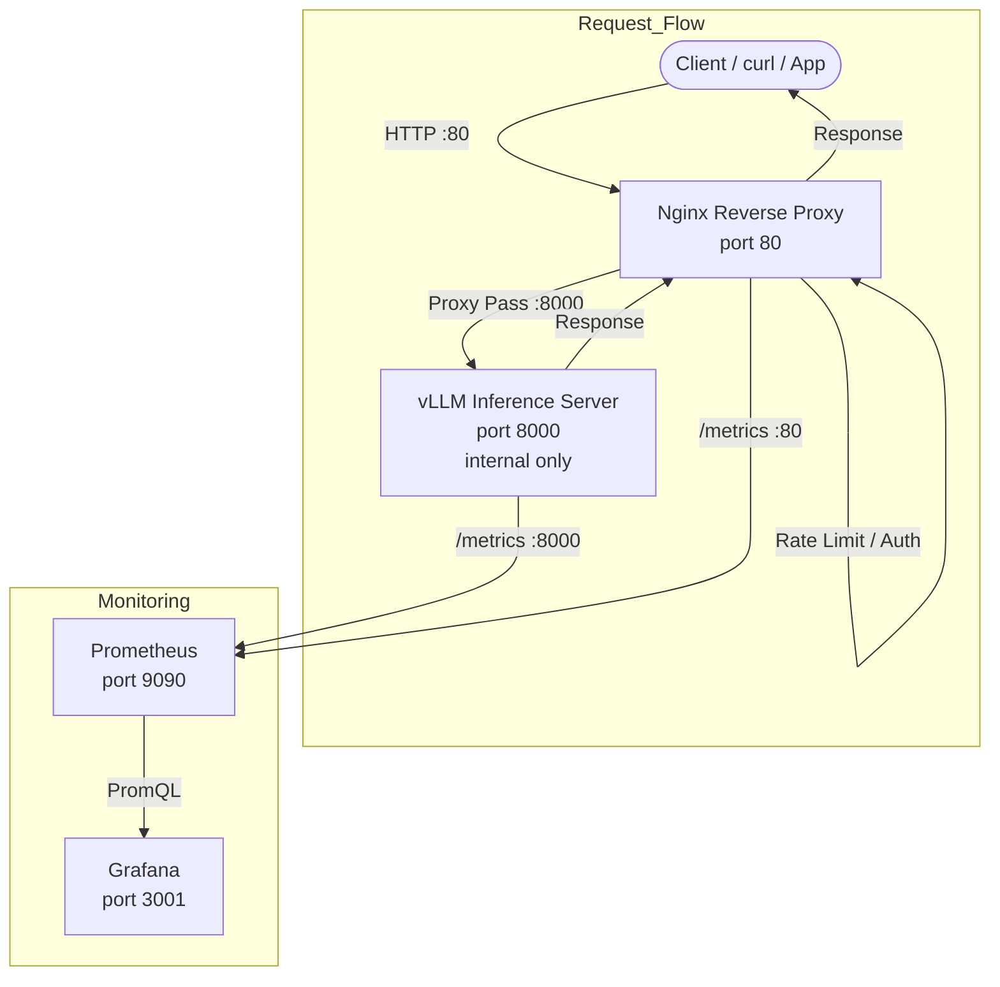

# Level 3: Nginx Gateway Deployment — vLLM + Nginx + Prometheus + Grafana

A production-grade LLM inference deployment with Nginx as a reverse proxy / API gateway in front of vLLM, with Prometheus monitoring and Grafana dashboards.

## Architecture



**Key difference from Level 2:** vLLM is **not directly exposed** to the host. All API traffic goes through Nginx on port 80. This provides:

- **Unified entry point** — single endpoint for all API calls
- **Rate limiting** — per-IP limits protect GPU resources
- **Internal network isolation** — vLLM is only reachable via Docker DNS
- **Request buffering** — configurable timeouts and body sizes
- **Extensible auth layer** — API key validation, TLS termination, etc.

## File Structure

```
nginx_getway_deployment/
├── compose.yml              # Docker Compose: Nginx + vLLM + Prometheus + Grafana
├── nginx/
│   └── nginx.conf           # Nginx reverse proxy configuration
├── prometheus/
│   └── prometheus.yml       # Prometheus scrape config (scrapes vLLM + Nginx)
├── grafana/
│   ├── datasources/
│   │   └── datasource.yml   # Auto-provisioned Prometheus data source
│   └── dashboards/
│       ├── dashboard.yml    # Dashboard provider config
│       └── llm-metrics.json # Pre-built vLLM Inference Metrics dashboard
└── README.md                # This file
```

## Prerequisites

- Docker Engine 24+ and Docker Compose plugin (v2+)
- NVIDIA GPU with CUDA 7.0+, Driver 535+, and NVIDIA Container Toolkit
- `HF_TOKEN` (optional, for gated models)

## Quick Start

```bash
# 1. Clone and enter directory
cd level3/nginx_getway_deployment

# 2. Set HF_TOKEN if needed (optional for public models)
# echo "HF_TOKEN=hf_xxx" > .env

# 3. (Optional) Set API key to enable authentication
# echo "NGINX_API_KEY=sk-your-secret-key" >> .env

# 4. Start the stack
docker compose up -d

# 5. Check all services are healthy
docker compose ps

# 6. Wait for vLLM to load the model
docker compose logs -f vllm
# Wait for: "Uvicorn running on http://0.0.0.0:8000"
```

### Enabling API Key Authentication

Set `NGINX_API_KEY` in `.env` or as an environment variable:

```bash
echo "NGINX_API_KEY=sk-my-secret-key" >> .env
docker compose up -d
```

When enabled, all `/v1/*` requests must include:
```
Authorization: Bearer sk-my-secret-key
```

Without it, requests return `401 Unauthorized`. Leave `NGINX_API_KEY` empty (default) to disable auth.

## Access Points

| Service  | URL                            | Credentials     |
|----------|--------------------------------|-----------------|
| vLLM API | `http://localhost/v1/models`   | —               |
| Prometheus | `http://localhost:9090/targets` | —             |
| Grafana  | `http://localhost:3001`        | admin / admin   |

> vLLM is **not** directly exposed on the host. Direct access `http://localhost:8000` will fail.

## Nginx Configuration Highlights

### Rate Limiting

```nginx
# 60 requests per minute per IP for general API
limit_req_zone $binary_remote_addr zone=api_limit:10m rate=60r/m;

# 20 requests per minute per IP for compute-heavy endpoints
limit_req_zone $binary_remote_addr zone=completion_limit:10m rate=20r/m;
```

### Proxy Rules

| Location                  | Upstream                  | Rate Limit        | Notes                  |
|---------------------------|---------------------------|-------------------|------------------------|
| `/v1/chat/completions`    | `vllm_backend`            | completion (20/m) | Streaming enabled      |
| `/v1/completions`         | `vllm_backend`            | completion (20/m) | Streaming enabled      |
| `/v1/` (other)            | `vllm_backend`            | api (60/m)        | Models, embeddings     |
| `/health`                 | `vllm_backend`            | —                 | Internal only          |
| `/metrics`                | `vllm_backend`            | —                 | Internal only          |

### Internal Endpoint Access

`/health` and `/metrics` are restricted to Docker internal IPs (`172.0.0.0/8`) and localhost.

## API Usage

All API calls go through Nginx on port 80. If API key auth is enabled, include the `Authorization` header.

```bash
# List models (no auth)
curl http://localhost/v1/models

# With API key auth
curl http://localhost/v1/models \
  -H "Authorization: Bearer sk-my-secret-key"

# Chat completion
curl http://localhost/v1/chat/completions \
  -H "Content-Type: application/json" \
  -H "Authorization: Bearer sk-my-secret-key" \
  -d '{
    "model": "",
    "messages": [{"role": "user", "content": "Hello!"}],
    "max_tokens": 50
  }'

# Streaming
curl http://localhost/v1/chat/completions \
  -H "Content-Type: application/json" \
  -H "Authorization: Bearer sk-my-secret-key" \
  -d '{
    "model": "",
    "messages": [{"role": "user", "content": "Count to 5."}],
    "max_tokens": 50,
    "stream": true
  }'
```

### Python client

```python
from openai import OpenAI

client = OpenAI(
    base_url="http://localhost/v1",
    api_key="sk-my-secret-key",  # set to "" if auth is disabled
)

response = client.chat.completions.create(
    model="Qwen/Qwen3-0.6B",
    messages=[{"role": "user", "content": "Hello!"}],
)
print(response.choices[0].message.content)
```

## Monitoring

### Prometheus

Prometheus scrapes two targets every 15 seconds:
- **vLLM** at `vllm:8000/metrics` — inference metrics (tokens, latency, cache)
- **Nginx** at `nginx:80/metrics` — request metrics (requires nginx-prometheus-exporter for full stats)

Check targets: http://localhost:9090/targets

### Grafana

Grafana is pre-configured with:
- Prometheus data source pointing at `http://prometheus:9090`
- vLLM Inference Metrics dashboard (18 panels)

Login at http://localhost:3001 (`admin` / `admin`)

### Key vLLM Metrics

| Metric                          | Description                          |
|---------------------------------|--------------------------------------|
| `vllm:num_requests_running`    | Currently processing requests         |
| `vllm:num_requests_waiting`    | Requests queued in scheduler          |
| `vllm:gpu_cache_usage_perc`    | GPU KV cache utilization              |
| `vllm:time_to_first_token_seconds` | Prompt processing latency         |
| `vllm:e2e_request_latency_seconds` | End-to-end request latency        |

## Useful Commands

```bash
docker compose up -d              # Start all services
docker compose down               # Stop all services
docker compose logs -f nginx      # Watch Nginx access/error logs
docker compose logs -f vllm       # Watch vLLM startup
docker compose logs -f prometheus # Watch Prometheus scraping
curl http://localhost/health      # Health check (via Nginx)
curl http://localhost/v1/models   # Test API (via Nginx)
```

## Troubleshooting

| Symptom                          | Likely Cause                      | Fix                                  |
|----------------------------------|-----------------------------------|--------------------------------------|
| `curl: (52) Empty reply` on `:80` | Nginx not ready / vLLM unhealthy | Wait for vLLM logs, check `docker compose ps` |
| `502 Bad Gateway`                 | Nginx cannot reach vLLM           | Run `docker compose logs nginx`, verify vLLM is healthy |
| `429 Too Many Requests`           | Rate limit exceeded               | Wait 1 minute, reduce request frequency |
| `401 Unauthorized`                | Missing/invalid API key           | Pass `Authorization: Bearer <key>` header, or disable auth by leaving `NGINX_API_KEY` empty |
| `403 Forbidden` on `/metrics`     | Request from outside Docker net   | Use Prometheus internally, not browser |
| GPU OOM                           | Model too large / high concurrency | Reduce `--max-model-len` or `--gpu-memory-utilization` |

## Production Considerations

- **TLS:** Add a `server` block with SSL certificate for HTTPS termination
- **API keys:** Add `$http_authorization` validation in Nginx `location` blocks
- **Multiple replicas:** Add more vLLM containers to `upstream vllm_backend`
- **DCGM Exporter:** Deploy NVIDIA DCGM Exporter for GPU utilization/temperature metrics
- **Nginx metrics:** Use `nginx-prometheus-exporter` sidecar for full Nginx request metrics
