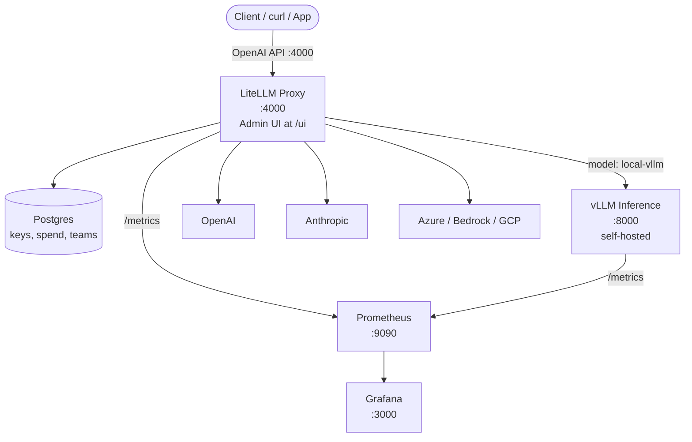

# LiteLLM Proxy Deployment — AI Gateway for LLMs

An open-source AI gateway that provides a unified OpenAI-compatible API endpoint across 100+ LLM providers (OpenAI, Anthropic, Google, AWS Bedrock, Azure, vLLM, Ollama) with a **built-in Admin UI** for managing models, virtual keys, teams, and spend tracking.

## Why LiteLLM Instead of Nginx?

| Feature | Nginx Proxy (Level 3) | LiteLLM Proxy |
|---------|----------------------|----------------|
| **Routing** | Static `proxy_pass` rules | Dynamic multi-model, multi-provider routing |
| **UI** | None | `/ui` — Admin dashboard |
| **Model management** | Manual config + reload | Add/remove via UI or API at runtime |
| **Provider support** | Any HTTP backend | 100+ LLM providers built-in |
| **Load balancing** | Manual upstream config | Weighted routing, fallbacks, failover |
| **Spend tracking** | None | Per-key, per-team budget + cost tracking |
| **Rate limiting** | Nginx `limit_req` | Per-key RPM/TPM, per-user, per-team |
| **Virtual keys** | None | Generate scoped keys with limits |

## Architecture



## Project Structure

```
lite_llm_proxy_deployment/
├── README.md              # This file
├── litellm.md             # Full CLI commands reference
├── compose.yml            # Docker Compose (3 profiles)
├── config.yaml            # Model + provider configuration
├── .env.example           # Environment variables template
├── prometheus/
│   └── prometheus.yml     # Prometheus scrape config
└── grafana/
    ├── datasources/
    │   └── datasource.yml # Auto-provisioned data source
    └── dashboards/
        └── dashboard.yml  # Dashboard provider config
```

## Quick Start

### 1. Configure

```powershell
# Copy env template
Copy-Item .env.example .env

# Edit .env — set your LLM provider API keys
# Edit config.yaml — add your models
```

### 2. Start

```powershell
# Standalone — LiteLLM only (no DB, basic UI without login)
docker compose up -d

# With Postgres — virtual keys, spend tracking, UI auth
docker compose --profile with-db up -d

# With vLLM — LiteLLM + self-hosted inference engine
docker compose --profile with-vllm up -d

# Full stack — LiteLLM + Postgres + vLLM + Prometheus + Grafana
docker compose --profile full-stack up -d
```

### 3. Use

```
API:     http://localhost:4000
Admin UI: http://localhost:4000/ui
Swagger:  http://localhost:4000/
```

```powershell
curl.exe -X POST http://localhost:4000/chat/completions `
  -H "Content-Type: application/json" `
  -H "Authorization: Bearer sk-your-master-key" `
  -d '{\"model\": \"gpt-4o-mini\", \"messages\": [{\"role\": \"user\", \"content\": \"Hello!\"}]}'
```

## Key Concepts

**Model routing:** The `config.yaml` `model_list` maps user-facing `model_name` (what the client sends) to `litellm_params.model` (provider/model identifier). LiteLLM extracts the provider from the model prefix and routes accordingly.

**Virtual keys:** Generate scoped API keys with RPM/TPM limits and budget caps from the Admin UI or `/key/generate` endpoint. Each key's usage is tracked independently.

**Admin UI:** Available at `/ui`. Requires `LITELLM_MASTER_KEY` and a database (use `with-db` profile) for login.

## See Also

- [litellm.md](./litellm.md) — Complete CLI commands reference
- [Level 3 Nginx Gateway](../level3/nginx_getway_deployment/README.md)
- [LiteLLM Docs](https://docs.litellm.ai/)
